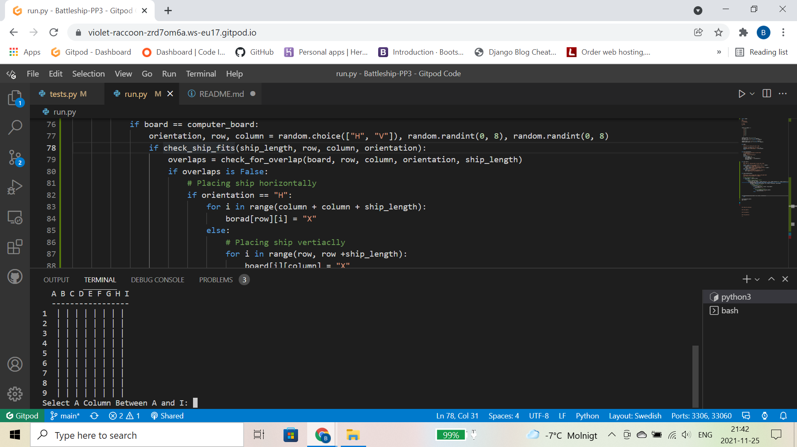
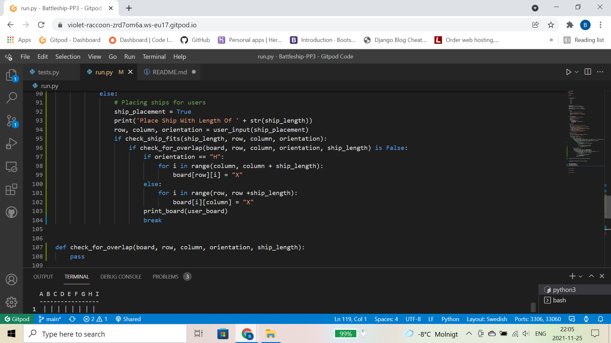
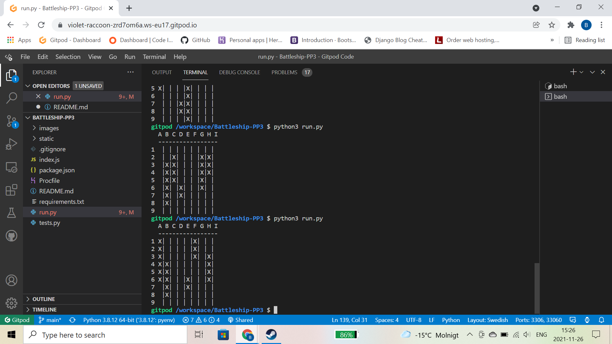
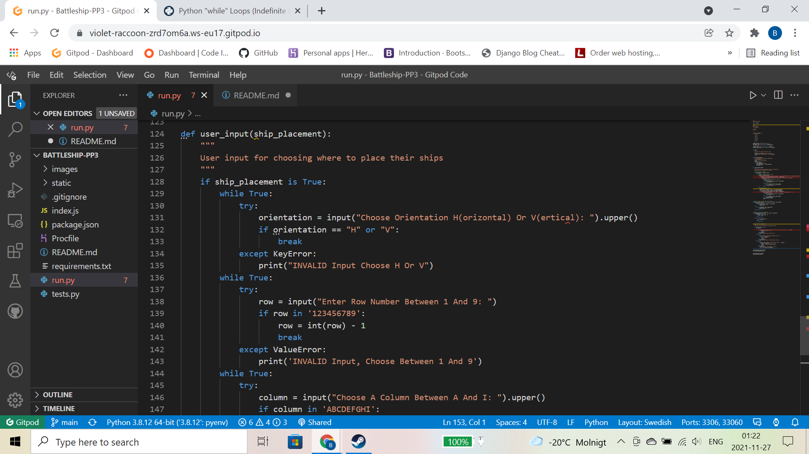
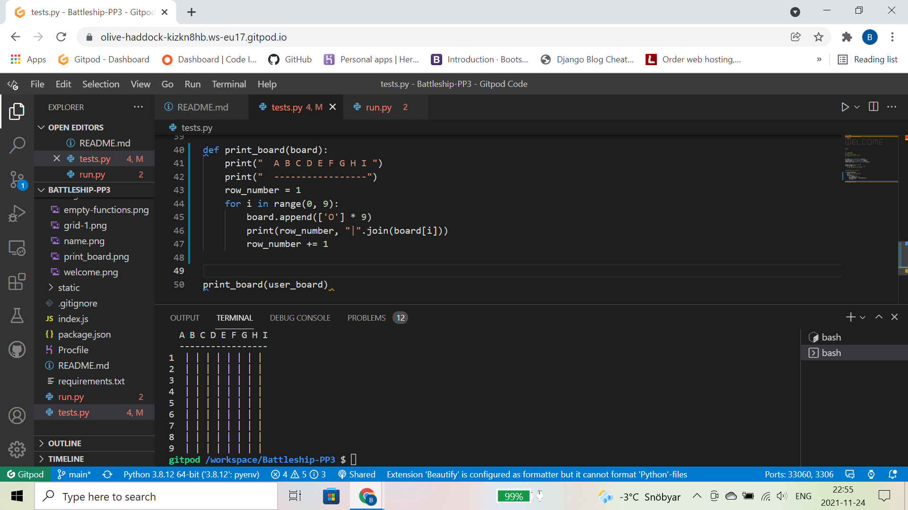
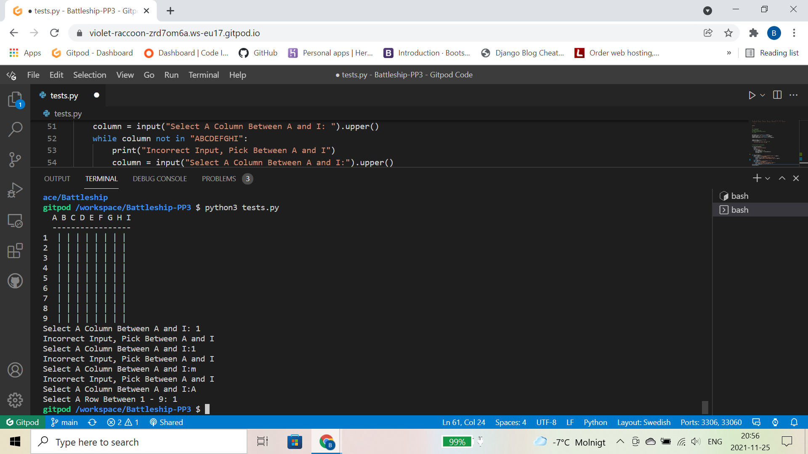
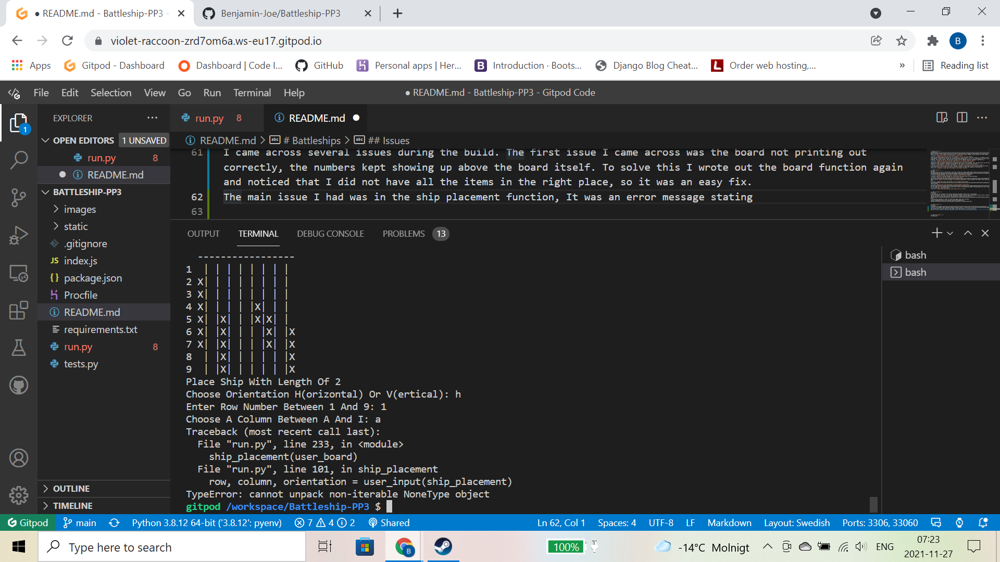

# Battleships

## Table Of Content
1. [ Resubmit ](#resubmit)
2. [ Build  ](#build)
3. [Tests](#tests)
4. [Sources](#sources)
5. [Issues](#issues)
6. [Deployment](#deployment)

## Resubmit
As this is a resubmit, I already had a lot of the code needed written out, so I have reused a lot of the code from the previous submission, but with all of the issues from last time addressed
This is the resubmission for pp3 with code institute. The fail reason's were due to the following:  
Bug causing ships to be placed ontop of eachother  
Lack of bug fixes  
Lack of content in readme  
Did not meet pep 8 requirements,  
For this resubmission I will be creating the same game as last time, only this time with the improvements necessary to reach a passing grade. 

## The Build
The first thing I did for the build was write out all the functions I thought I would need for this project and add them to run.py, I also creates a tests.py file so I could test various aspects of the project as I went along.  
  
  
Creating the ship_placement function was a challenge as I could not get it to work initially. I needed to write a large amount of code in order to get it funcitonal without being able to test it as I went along. It took a few attempts, the initial draft of the function is below for the computer and user placement respectively:  

  
Getting the ships to display randomly on the computer board took a few attempts. Each new game prints out the ships randomly for the computer, I printed three boards to test that it all works with no errors.  

I then started to write out the user input function in detail. This allows for users to place items where they would like to and also it asks the users to pick the locations of where the computers ships might be.  

Once the user input was complete it was a case of bringing it all together and adding some error handling, and moving code from my previous submission over to this workspace

## Tests
By adding tests.py file to the project I was able to test out various game aspects below and ensure everything was working correctly. The First test I did was create a name function that asks the user for their name. I used this to add personalised messages at the end of the game, increasing user experience.  

I played around with a welcome message for users before the game starts as pictured below.  
  
The original grid code was taken from the video linked in the sources section. I decided to try a few things and make it my own. Below is my first attempt at a different approach for a grid. However the numbers print above the grid.  

The second attempt at creating my own version of the game board is below, it works well other than it looking a little untidy.  

The first draft for the ship placement is pictured below. It asks users to choose between A and I and 1 and 9, this will be used later for asking users to place their ships on the game board.(NOTE: ship placement was later renamed to user_input as it made more sense.)

For the rest of the code, I reused quite a bit from my last submission so it was already tested and worked correctly, But as a final test, I put the code through the pep 8 tester to ensure everything was up to scratch

## Sources
I had help with this project from various websites and people, they are all listed below:  
Antonio Rodrigues - My mentor, he has been incredibly helpful and gone above and beyond to ensure that I perform to the best of my abilities, He also has the patience of a god to put up with me :) .  
Student Mentors - The student mentors on code institute have proven to be a lifesaver on a few occasions, great help :)  
I used several websites in order to create this game, they are as follows:  
[Initial GameBoard And Letters To Numbers](https://www.youtube.com/watch?v=tF1WRCrd_HQ)  
[Random Ship Generator](https://www.w3schools.com/python/ref_random_choice.asp)  
[ Stack Overflow ](https://stackoverflow.com/)  
[FreeCodeCamp](https://www.freecodecamp.org/learn)  

## Issues
I came across several issues during the build. The first issue I came across was the board not printing out correctly, the numbers kept showing up above the board itself. To solve this I wrote out the board function again and noticed that I did not have all the items in the right place, so it was an easy fix.  
The main issue I had was in the ship placement function, It was an error message stating  

## Deployment

