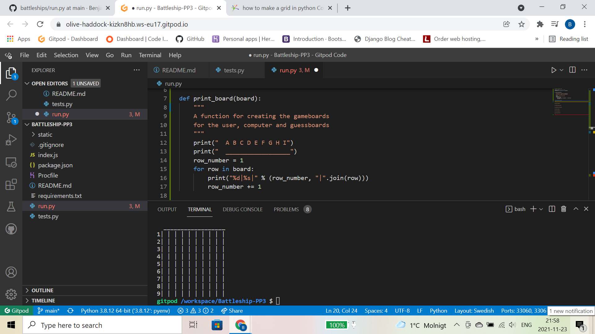
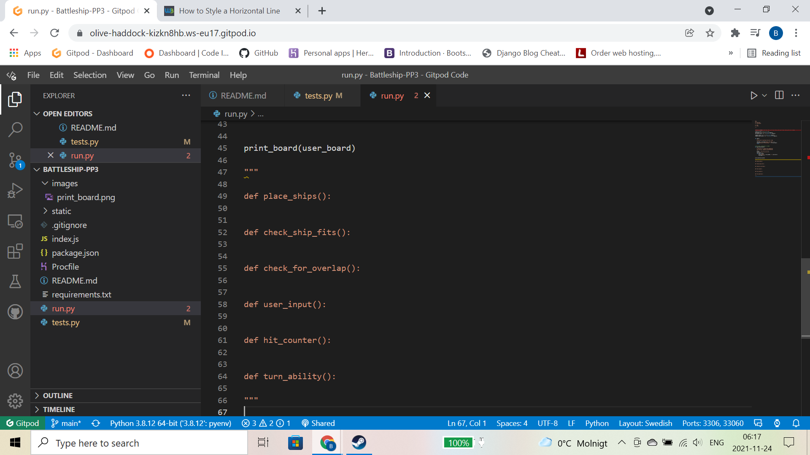
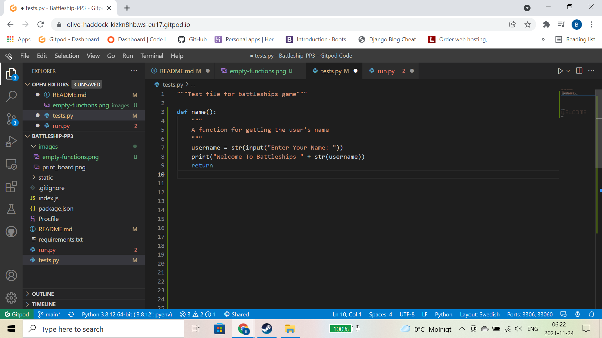
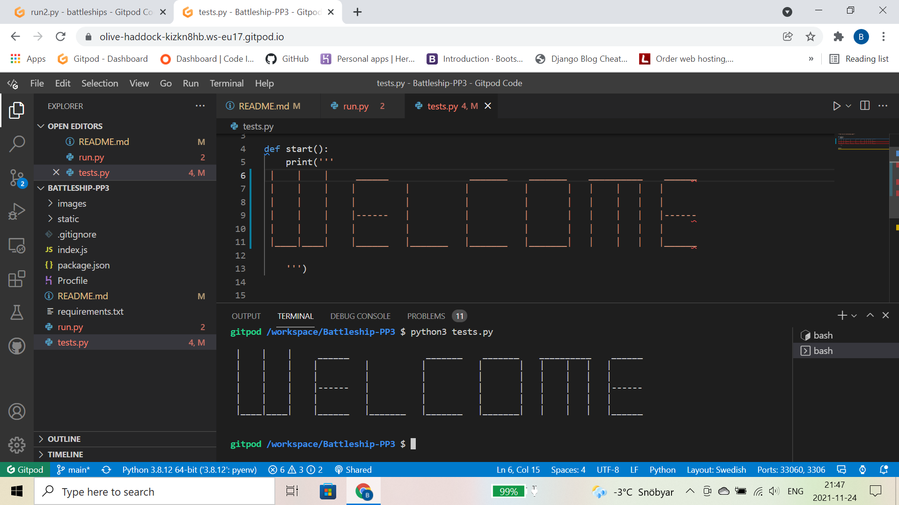
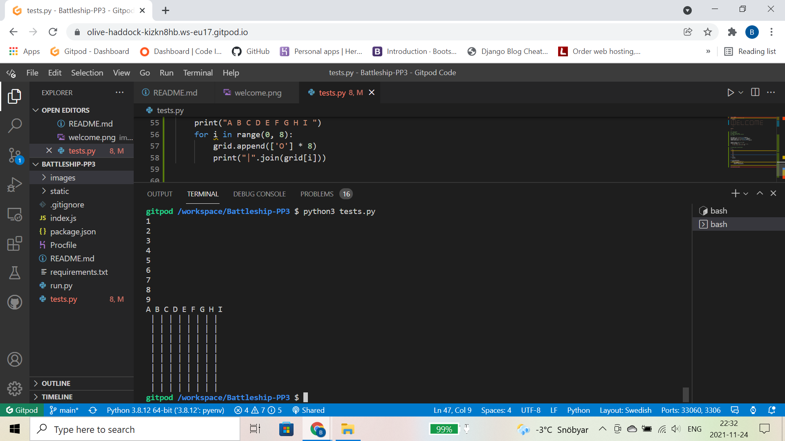

# Battleships

## Table Of Content
1. [ Resubmit ](#resubmit)
2. [ Build  ](#build)
3. [Tests](#tests)

## Resubmit
As this is a resubmit, I already had a lot of the code needed written out, so I have reused a lot of the code from the previous submission, but with all of the issues from last time addressed
This is the resubmission for pp3 with code institute. The fail reason's were due to the following:  
Bug causing ships to be placed ontop of eachother  
Lack of bug fixes  
Lack of content in readme  
Did not meet pep 8 requirements,  
For this resubmission I will be creating the same game as last time, only this time with the improvements necessary to reach a passing grade. 

## The Build
The first thing I did for the build was write out all the functions I thought I would need for this project and add them to run.py, I also creates a tests.py file so I could test various aspects of the project as I went along.  
  

## Tests
By adding tests.py file to the project I was able to test out various game aspects below and ensure everything was working correctly. The First test I did was create a name function that asks the user for their name. I used this to add personalised messages at the end of the game, increasing user experience.  

I played around with a welcome message for users before the game starts as pictured below.  
  
The original grid code was taken from the video linked in the sources section. I decided to try a few things and make it my own. Below is my first attempt at a different approach for a grid. However the numbers print above the grid.  

Code for print_board taken from here:
https://www.youtube.com/watch?v=tF1WRCrd_HQ